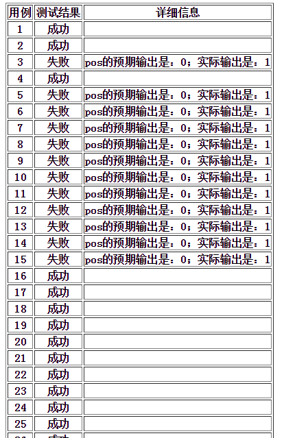

## Nohands

一个简单的自动化测试框架

关于自动化测试、该简单自动化测试框架的思路参见[《设计一个简单的自动化测试框架》](http://www.xumenger.com/auto-test-20161220/)

开发环境：Windows 7、Delphi 6

## Example：testpos

同时在example目录下给了一个简单的插件实现：测试Pos函数

该插件对应的dll名称为：testpos.dll，需要放置在程序的Plugins目录下

如下图在DBF中维护了52条测试用例，可以看到列信息分别有：FuncNo、in\_、out\_、want\_

对应该测试用例DBF名字为testpos.dbf，需要放置在程序的TestCases目录下

打开Nohands.exe，其界面如下，可以看到在任务列表中将该任务的名称、测试进度信息展示出来了

在任务列表中选中该任务，然后点击开始按钮进行测试

测试完成后工具截图如下，可以看到测试进度为52/52

再去查看测试情况，可以看到testpos.dbf中所有测试用例的out\_中有了实际输出

在TestCases目录下还生成了一个testpos\_yyyy-mm-dd.html的文件，其中是自动化测试的详细信息

